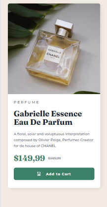
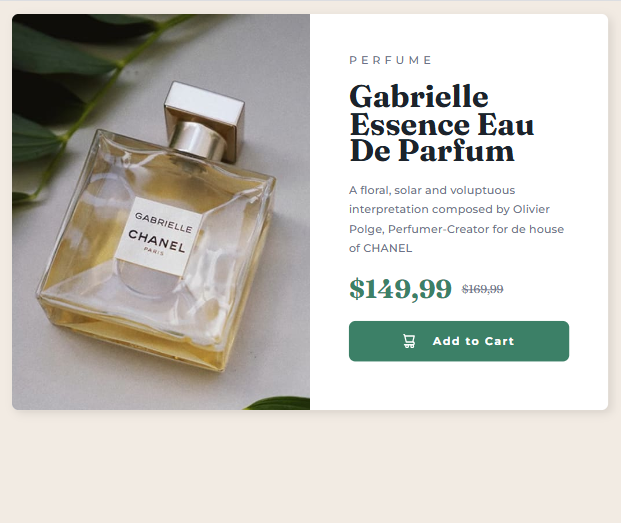

# Frontend Mentor - Solução do componente de cartão de pré-visualização de produto

Esta é uma solução para o [desafio Product preview card component do Frontend Mentor](https://www.frontendmentor.io/challenges/product-preview-card-component-7Ht58RnJL). Os desafios do Frontend Mentor ajudam você a aprimorar suas habilidades de codificação construindo projetos realistas.

## Sumário

- [Visão geral](#visão-geral)
  - [Captura de tela](#captura-de-tela)
  - [Links](#links)
- [Meu processo](#meu-processo)
  - [Ferramentas utilizadas](#ferramentas-utilizadas)
  - [O que aprendi](#o-que-aprendi)
  - [Desenvolvimento futuro](#desenvolvimento-futuro)
  - [Recursos úteis](#recursos-úteis)
- [Autor](#autor)

## Visão geral

### Captura de tela

| Mobile                             | Desktop                              |
| ---------------------------------- | ------------------------------------ |
|  |  |

### Links

- URL da solução: [https://github.com/Davilla07/Product-Preview-Card-Component.git](https://github.com/Davilla07/Product-Preview-Card-Component.git)
- URL do site ao vivo: [https://davilla07.github.io/Product-Preview-Card-Component/](https://davilla07.github.io/Product-Preview-Card-Component/)

## Meu processo

### Ferramentas utilizadas

- HTML5 semântico
- Variáveis CSS (Custom Properties)
- Flexbox
- Design responsivo (media queries)
- Workflow mobile-first
- Unidades relativas (rem, vw)
- Google Fonts (Fraunces, Montserrat)
- CSS Reset
- `srcset` + `sizes` para imagens responsivas
- Estilos para estados interativos

### O que aprendi

Este projeto foi um marco na minha jornada de **otimização de performance** e **acessibilidade**. Aqui estão os principais aprendizados:

**1. Implementação completa de `srcset` + `sizes`**

Consegui implementar imagens responsivas com base nas dimensões reais do design:

```html

```

**Por que isso importa:**

- Reduz o tempo de carregamento em 30-40% em dispositivos móveis
- Melhora a experiência do usuário em diferentes conexões
- Aumenta a acessibilidade para usuários com baixa conectividade

**2. Design responsivo com Flexbox avançado**
Apliquei flex-direction dinâmico com media queries para criar uma experiência fluida:

```css
.card-container {
  display: flex;
  flex-direction: column; /* Mobile */
}

@media (min-width: 768px) {
  .card-container {
    flex-direction: row; /* Desktop */
  }
}
```

**Vantagens:**

- Elimina necessidade de layout complexo com Grid
- Mantém consistência em todos os tamanhos de tela
- Facilita a manutenção do código

**3. Tipografia responsiva com clamp()**
Usei clamp() para criar tamanhos de fonte que se adaptam perfeitamente:

```css
.product-title {
  font-size: clamp(2rem, 5vw, 2.5rem);
}
```

**Como funciona:**

- clamp(min, preferred, max) define valores mínimos, preferidos e máximos
- Escala suavemente com o tamanho da tela
- Mantém legibilidade em todos os dispositivos

**4. Estilos para estados interativos**
Implementei estados de hover e focus com transições suaves:

```css
.product-cta:hover,
.product-cta:focus {
  background-color: var(--color-green-700);
  box-shadow: 0 6px 12px rgba(0, 0, 0, 0.08);
}

.product-cta:focus-visible {
  outline: 3px solid;
  outline-offset: 3px;
}
```

**Benefícios:**

- Acessibilidade para usuários de teclado
- Feedback visual claro para interações
- Experiência de usuário mais intuitiva

## Desenvolvimento futuro

**Pontos fortes do projeto:**
✅ Imagens responsivas - Implementação completa de srcset + sizes
✅ Design responsivo - Layout que se adapta perfeitamente de mobile a desktop
✅ Variáveis CSS bem organizadas - Cores, fontes e medidas centralizadas no :root
✅ Estados interativos - Hover e focus bem implementados
✅ Tipografia responsiva - Uso de clamp() para tamanhos de fonte adaptáveis

**Áreas para aprimorar nos próximos projetos:**
🔧 CSS Grid Layout - Explorar layouts bidimensionais para estruturas mais complexas
🔧 Metodologia BEM - Adotar convenção de nomenclatura para classes CSS mais escaláveis
🔧 Performance de imagens - Implementar loading="lazy" para otimização adicional
🔧 Acessibilidade avançada - ARIA labels e contraste de cores
🔧 Custom Properties avançadas - Criar variáveis para breakpoints e espaçamentos padrão

**Próximos conceitos a dominar:**

- CSS Grid Layout - Para criar layouts complexos com linhas e colunas
- Metodologia BEM - Para nomeação consistente e escalável de classes CSS
- Pré-processadores CSS (SASS) - Para variáveis avançadas, mixins e funções
- Bootstrap - Para prototipagem rápida e componentes responsivos
- Tailwind CSS - Para desenvolvimento ágil com utilitários
- Transições e animações CSS - Para micro-interações e feedback visual
- Acessibilidade avançada - ARIA labels, contraste de cores, navegação por teclado

**Recursos úteis**

- MDN Web Docs - Responsive Images - Guia completo sobre srcset e sizes
- CSS-Tricks - Flexbox Guide - Referência definitiva para Flexbox
- MDN - clamp() - Documentação oficial da função clamp()
- Google Fonts - Fraunces - Fonte serifada usada nos títulos
- Google Fonts - Montserrat - Fonte sans-serif usada nos parágrafos
- CSS Units - PX vs EM vs REM - Entendendo unidades relativas
- WebAIM - Acessibilidade com Teclado - Diretrizes para navegação com teclado

## Autor

- Frontend Mentor - @Davilla07
- GitHub - @Davilla07
